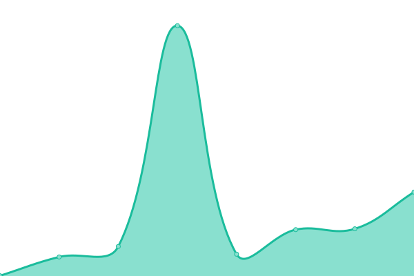
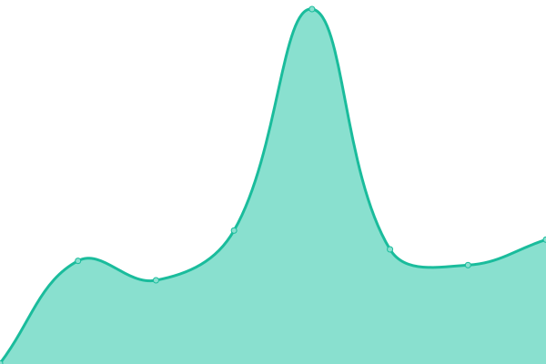

# [📈 Live Status](https://demo.upptime.js.org): <!--live status--> **🟧 Partial outage**

This repository contains the open-source uptime monitor and status page for [tutuis_me](https://tutuis.me), powered by [Upptime](https://github.com/upptime/upptime).

With [Upptime](https://upptime.js.org), you can get your own unlimited and free uptime monitor and status page, powered entirely by a GitHub repository. We use [Issues](https://github.com/bunizao/uptime/issues) as incident reports, [Actions](https://github.com/bunizao/uptime/actions) as uptime monitors, and [Pages](https://demo.upptime.js.org) for the status page.

<!--start: status pages-->
<!-- This summary is generated by Upptime (https://github.com/upptime/upptime) -->
<!-- Do not edit this manually, your changes will be overwritten -->
<!-- prettier-ignore -->
| URL | Status | History | Response Time | Uptime |
| --- | ------ | ------- | ------------- | ------ |
|  [Backend@SubsConverter](https://api.tuu.cat/version) | 🟥 Down | [backend-subs-converter.yml](https://github.com/bunizao/uptime/commits/HEAD/history/backend-subs-converter.yml) | 

 19623ms
     
 | 

<a href="https://demo.upptime.js.org/history/backend-subs-converter">0.00%</a>
    

|  [API@URLShortener](https://tuu.cat) | 🟥 Down | [api-url-shortener.yml](https://github.com/bunizao/uptime/commits/HEAD/history/api-url-shortener.yml) | 

 19724ms
     
 | 

<a href="https://demo.upptime.js.org/history/api-url-shortener">0.00%</a>
    

|  [Tutu's Blog](https://tutuis.me) | 🟩 Up | [tutu-s-blog.yml](https://github.com/bunizao/uptime/commits/HEAD/history/tutu-s-blog.yml) | 

 266ms
     
 | 

<a href="https://demo.upptime.js.org/history/tutu-s-blog">98.39%</a>
    

|  [With Moon's](https://buxx.me) | 🟥 Down | [with-moon-s.yml](https://github.com/bunizao/uptime/commits/HEAD/history/with-moon-s.yml) | 

 1131ms
     
 | 

<a href="https://demo.upptime.js.org/history/with-moon-s">98.39%</a>
    

<!--end: status pages-->

[**Visit our status website →**](https://demo.upptime.js.org)

## 📄 License

- Powered by: [Upptime](https://github.com/upptime/upptime)
- Code: [MIT](./LICENSE) © [tutuis_me](https://tutuis.me)
- Data in the `./history` directory: [Open Database License](https://opendatacommons.org/licenses/odbl/1-0/)
